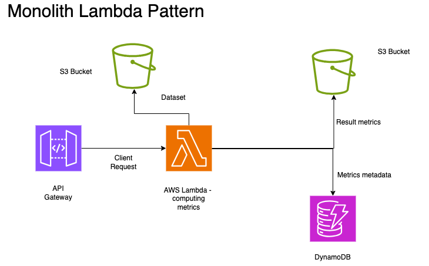
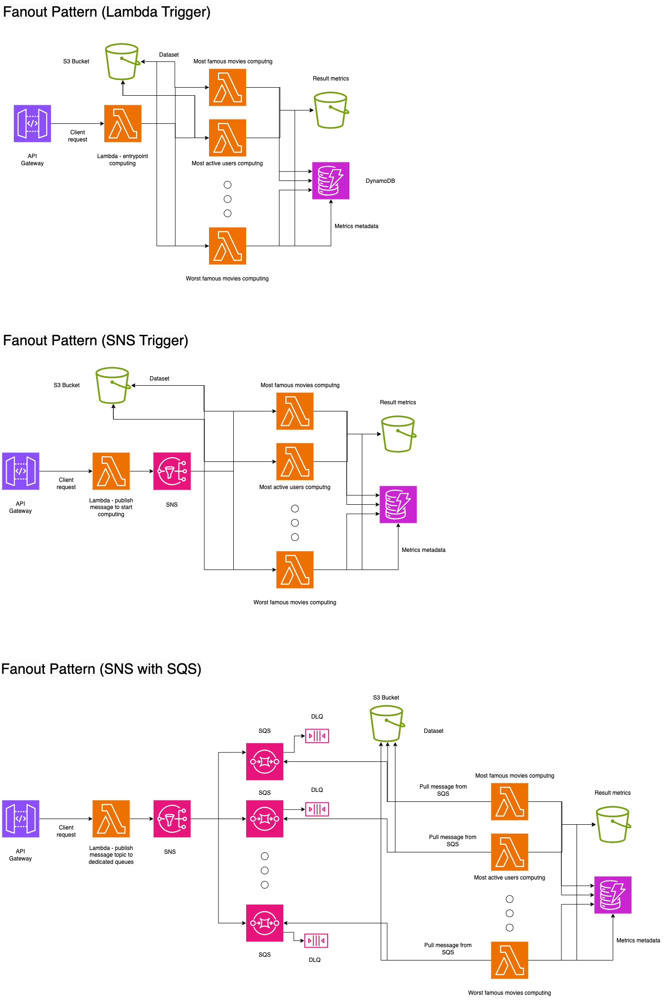
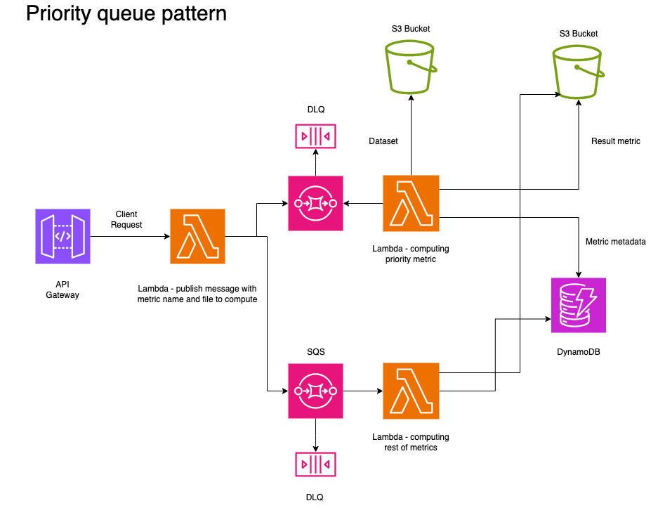

# Master Thesis - Performance Analysis of Serverless Design Patterns based on AWS Lambda

# Table of Contents

1. [Introduction](#introduction)
2. [Computing](#computing)
3. [Patterns](#patterns)

## Introduction

This repo is master thesis project about serverless desgin patterns carried out at Poznan University of Technology in the speclialisation Distributed and Cloud Systems.

## Computing

Each serverless pattern will be solving same problem - compute some of metrics based on the huge dataset. In master thesis I've used Kaggle Movie Dataset, which includes around 26 million ratings from 270 000 users for 45 000 movies. Source [here](https://www.kaggle.com/datasets/rounakbanik/the-movies-dataset). Each record has some properties:

- movieId
- userId
- rating (scale 0-5)
- timestamp.
  Huge dataset was divided by 10 subset files and parsed to JSON format. This files could represent variety of movie services like Filmweb, IMDb etc. Business logic is responsible for compute some metrics. This includes:
- Ranking of most famous movies (movies sorted by number of given ratings).
- Ranking of most active users.
- Rankig of best rated movies
- Ranking of best rated movies but by most frequently rated
- Movies with the highest amount of the best (greater than 4.0) rate and the worst rate (less than 3.0).

## Patterns

### Monolith Computing

This pattern is the simplest approach to serverless computing. It only consists of one Lambda which is responsible for managing and computing metrics. After each computation result is saved in S3 bucket and metadata in DynamoDB table.

_Monolith Computing Pattern_

### Messaging Pattern

This type of serverless pattern is focusing on passing messages to Lambda rather than improving computing performance. There is entry Lambda which focus on passing to SQS queue different messages which consist of information which file (movie service) to get as input data and which metric to compute. There is element which improves safeness - Dead Letter Queue (DLQ), which allows cloud administrator capture messages which had not served by computing Lambda. Right part of pattern is same as previous solution.

_Message passing pattern_

### Fanout pattern(s)

This pattern is specific version of _messaging pattern_.
Fanout is a pattern which focus on decoupling computation into dedicated Lambdas (each metric has own Lambda) and in front there is entry Lambda (works as a trigger) which delegates computing to each Lambda separately. Every computing Lambda gets data from S3, compute and save result. There are multiple varieties of Fanout pattern. Each of them tries to improve most important architecture metrics: _scalability_, _fault tolerance_ and _performance_. Version with SQS is secured by dedicated DLQ for each queue.
Modifications of Fanout pattern:

- Fanout pattern (SNS trigger)
- Fanout pattern (SNS with dedicated SQS queues)
  Approach with SNS as trigger has one topic subscribed by every compute Lambda. Moreover, the last Fanout solution also has a pub-sub SNS service, but has as many topics defined as there are film metrics.

_Fanout Patterns_

### Priority Queue Pattern

This is another variety of message passing pattern which allows cloud architect defines priority metric to compute for target customer. Rest of metrics are computed by second SQS and Lambda.

_Priority Queue Pattern_
